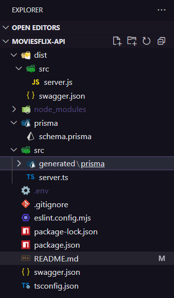

<h1 align="center">🎬 MoviesFlix API</h1>

Tabela de conteúdos
=================

   * Sobre o projeto
   * Tecnologias
   * Layout
## Sobre o Projeto

Bem seguindo, e avançando curso DevQuest Full-Stack, agora do lado do backend, e passado em Projeto com Node e PostgreSQL, onde foi desenvolvida a MoviesFlix é uma API RESTful, que permite, listar todos os filmes, criar, atualizar, deletar filmes, filtrar filmes por nome do gênero e visualizar detalhes relacionados a idiomas e gêneros

---

## 🚀 Tecnologias Utilizadas

- **Node.js**
- **Express**
- **TypeScript**
- **Prisma ORM**
- **Swagger (swagger-ui-express)**

---
## ⚙️ Como Rodar o Projeto

### Pré-requisitos

- Node.js (v18+)
- npm ou yarn
- Banco de dados configurado no `.env` (ex: PostgreSQL)
- Prisma CLI (`npx prisma`)

### Passo a passo

# Clone o repositório

➡️ git clone https://github.com/Carvalhorp2022/moviesflix-api.git

# Acesse o diretório

➡️ cd moviesflix-api

# Instale as dependências

➡️ npm install

# Gere os arquivos Prisma e conecte ao banco
➡️ npx prisma generate
➡️ npx prisma migrate dev

# Inicie o servidor
➡️ npm run dev

📖 Documentação da API
A documentação Swagger estará disponível após iniciar o servidor:

http://localhost:3000/docs

🔗 Endpoints Principais:

✅ Listar todos os filmes
GET /movies

➕ Criar um novo filme
POST /movies

Body:
{
  "title": "Inception",
  "genre_id": 1,
  "language_id": 1,
  "oscar_count": 4,
  "release_date": "2010-07-16"
}

✏️ Atualizar um filme
PUT /movies/{id}

Body: (igual ao POST)

🗑️ Deletar um filme
DELETE /movies/{id}

🎯 Filtrar filmes por gênero
GET /movies/genre/{genreName}

🛠 Estrutura do Projeto
